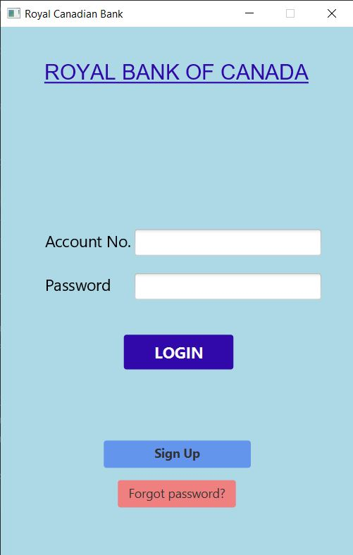
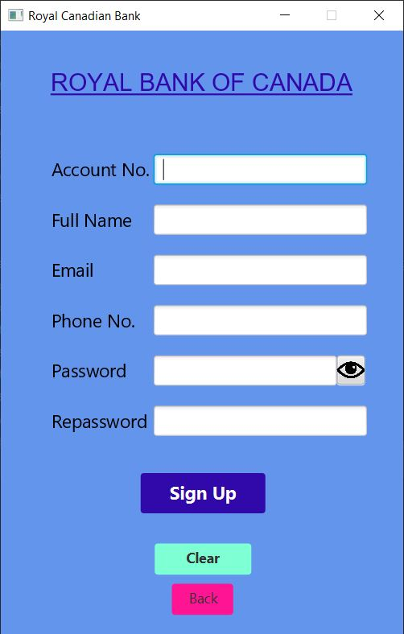
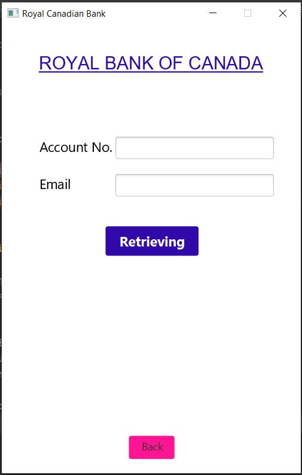
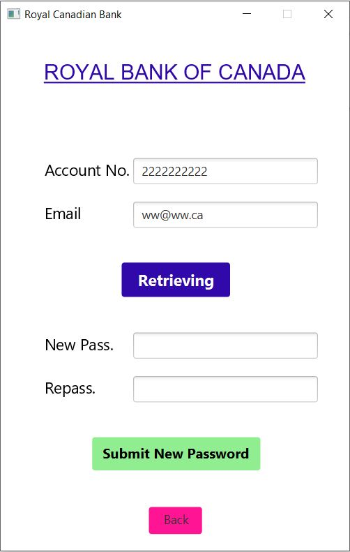
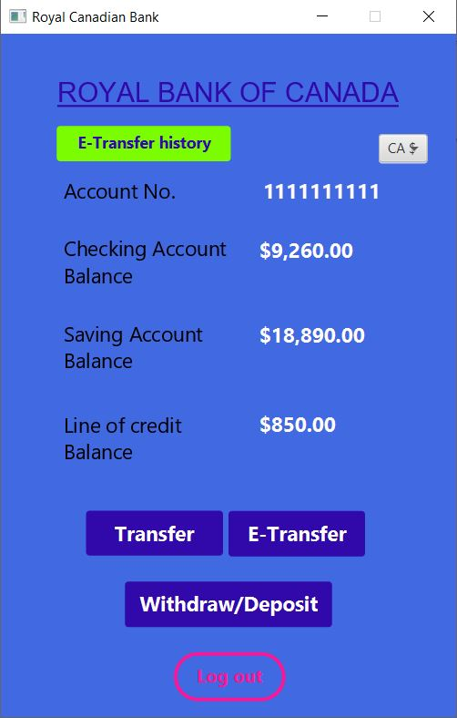

# ATMachin
<style type="text/css"> 
.image {
  margin-right="20px"
}
This is a JavaFx application. 
• It works like an ATM machine/Bank account application. 
•	It encrypts the password before saving password on the local database. 
•	It uses XAMPP as a local server (PHPMyAdmin) and is connected to MySql as a local database.  
•	For encryption, it salts the password with a 10 random characters and using SHA2-256 for hashing. Just the result save in database and nobody has access to the password.
•	It uses SQL commands to get, insert, update, and delete data. 
• At the begining, user faces up with Login page.
 
• Users can signup if they have not registered yet.
 
• In case the password is forgotten, users can create another password.
 
• When user login successfully
 

•
•
•
•
•
•
•
•
