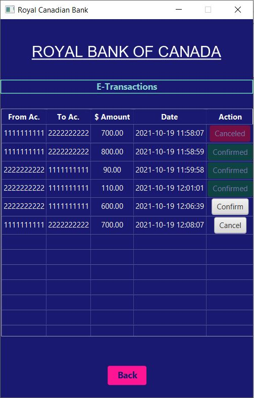
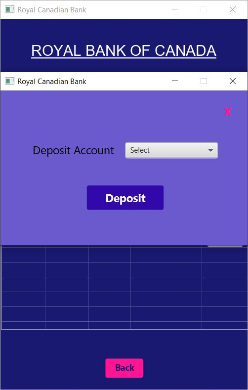
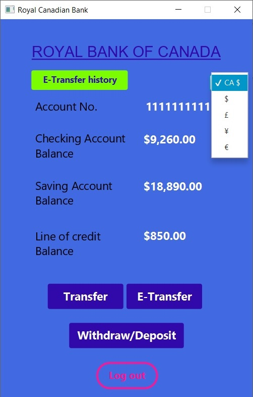
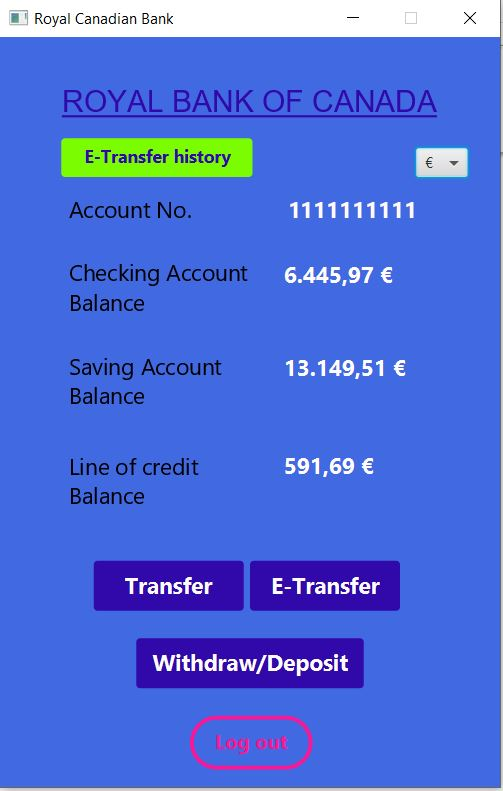
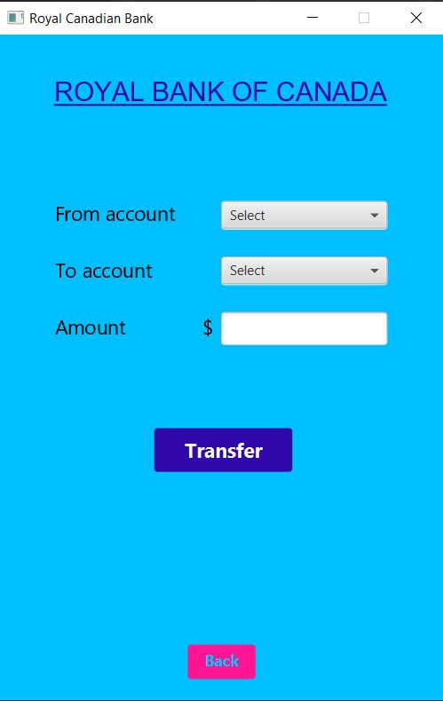
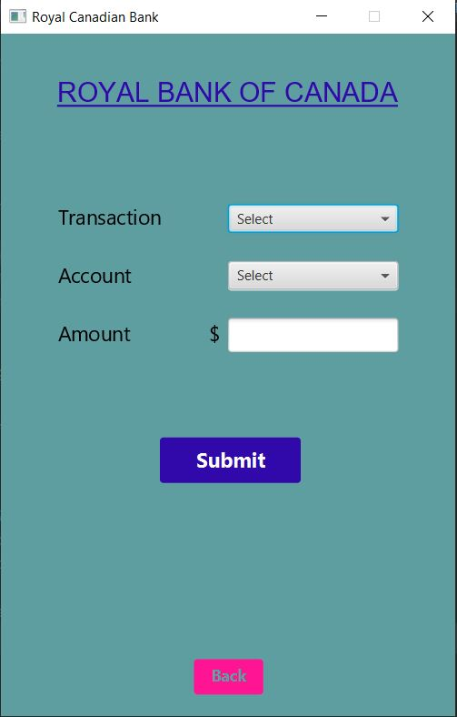
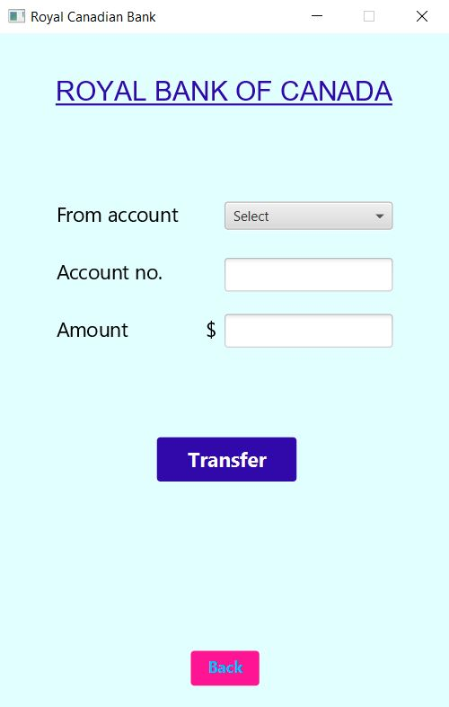

# ATMachin

This is a JavaFx application. 
• It works like an ATM machine/Bank account application. 
•	It encrypts the password before saving password on the local database. 
•	It uses XAMPP as a local server (PHPMyAdmin) and is connected to MySql as a local database.  
•	For encryption, it salts the password with a 10 random characters and using SHA2-256 for hashing. Just the result save in database and nobody has access to the password.
•	It uses SQL commands to get, insert, update, and delete data. 

• At the begining, user faces up with Login page.
 

• Users can signup if they have not registered yet.
 

• In case the password is forgotten, users can create another password. 
 

• When user login successfully, there will be appeared a red attention message if a not confirmed etransaction exists. 
 

• If users click on the E-Transaction history/New e-transaction buttons, they can see the history of etransactions, cancel the amount sent (before than other uuser confirmation, or confirm the transaction. If user confirms transaction, a new window pops up and user has to select the deposit account. 
 

• User can change the unit currency with select currensy in the dropdown menu, application will get the exchange rateautomatically with using rest API from ExchangeRate-API. 
 

• User can transfer, withdraw, deposit, or Etransfer money. 
 

• User can see the transactions in each account with clicking on the amount. 
 

• You can see the project files.
 
